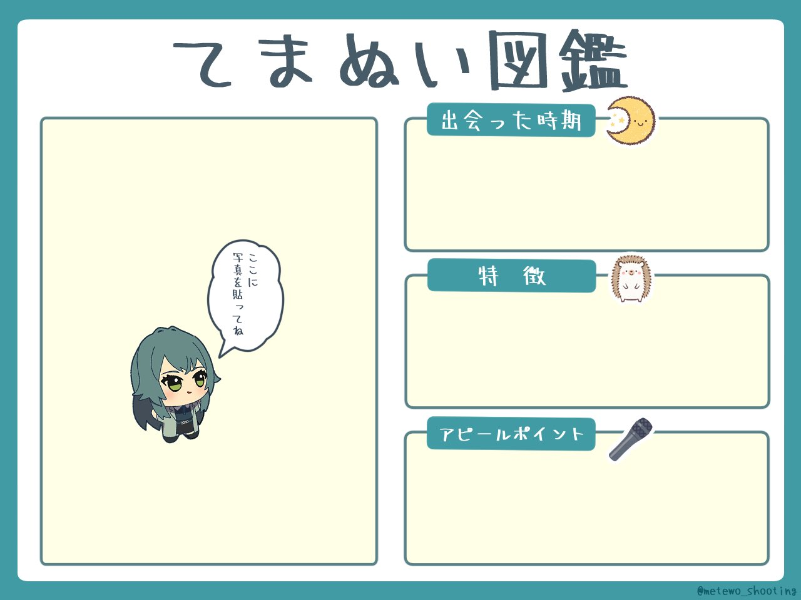

# てまぬい図鑑ジェネレーター

大切なてまぬいの紹介カードを作れるWebアプリ。写真をアップロードするだけで、てまぬい図鑑カードが完成！

**デモ: https://temanuibookgenerator.pages.dev/**



## 機能

- 写真アップロード・トリミング（ピンチ/ドラッグ対応）
- AI背景除去（`@imgly/background-removal`）
- テキスト入力（出会い・特徴・アピールポイント）
- フォント選択（7種類）
- PNG書き出し（1280×960px）

## 開発

```bash
npm run dev
# → http://localhost:3000
```

ビルド不要。静的ファイルをそのまま配信。

## 構成

| ファイル | 役割 |
|---|---|
| `index.html` | 4ステップSPA |
| `app.js` | 全ロジック（バニラJS + Canvas API） |
| `style.css` | 全スタイル |
| `template.jpg` | テンプレート画像 1280×960（by @metewo_shooting） |
| `_headers` | Cloudflare Pages用 COOP/COEP ヘッダー |
| `tools/calibrate.html` | 座標キャリブレーションツール |

## デプロイ

Cloudflare Pages にリポジトリルストをそのまま push するだけ。`_headers` が COOP/COEP を自動設定する（AI背景除去の SharedArrayBuffer に必要）。

## ライセンス

テンプレート画像の著作権は @metewo_shooting に帰属します。
